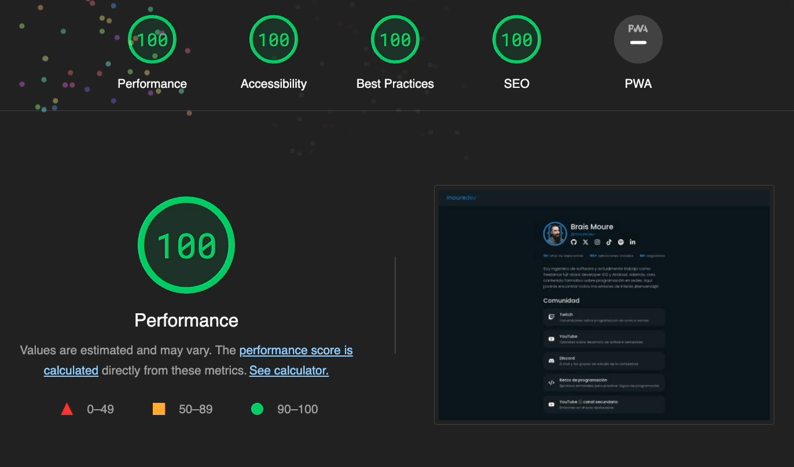

# Web de links de MoureDev

[](https://python.org)
[](https://fastapi.tiangolo.com)

## Proyecto desarrollado con [Python](https://www.python.org/) y [Reflex](https://reflex.dev/) que representa un sitio web personal estilo "[link in bio](https://moure.dev/)"




## Tutorial

Consulta el [curso](../README.md) de 6 horas en vídeo desde cero que muestra el proceso de desarrollo de la web.

## Requisitos

#### Instala y crea un entorno virtual [venv](https://packaging.python.org/en/latest/guides/installing-using-pip-and-virtual-environments/) en la raíz del proyecto
Mac/Linux: `python3 -m pip install virtualenv`

Windows: `py -m pip install --user virtualenv`

`python3 -m venv venv`

#### Activa el entorno virtual 
Mac/Linux: `source venv/bin/activate`

Windows: `.\venv\Scripts\activate`

Para desactivar el entorno virtual: `deactivate`

## Dependencias
*(Con el entorno virtual activo)*

`pip install reflex`

También las tienes en `requirements.txt`

`python -m pip install -r requirements.txt`

## Ejecución
`reflex run`

`reflex run --loglevel debug` *(modo debug)*

Acceder a [http://localhost:3000](http://localhost:3000) (frontend) y a [http://localhost:8000](http://localhost:8000) (backend)

## Despliegue

El script build.sh contiene las instrucciones necesarias para empaquetar el frontend del proyecto y desplegarlo de forma estática. Éste, en concreto, desde [Vercel](https://vercel.com/).

`sh build.sh`

```bash
source .venv/bin/activate
pip install --upgrade pip
pip install -r requirements.txt
reflex init
reflex export --frontend-only
rm -fr public
unzip frontend.zip -d public
rm -f frontend.zip
deactivate
```

*Básicamente, prepera el entorno, instala dependencias, inicializa el proyecto, crea la construcción de producción, y la descomprime.*

> El proyecto se puede desplegar en cualquier proveedor o servidor que soporte recursos estáticos.
> 
> [moure.dev](https://moure.dev) se encuentra desplegado en [Vercel](https://vercel.com).

Configuración en Vercel:

* Se ha asociado el repositorio de GitHub al proyecto (para que cada `push` en la rama `main` desencadene un nuevo despliegue)
* Build & Development Settings: Other
* Root Directory: `public` (que contiene el empaquetado estático para producción)
* Custom Domain: adviento.dev 